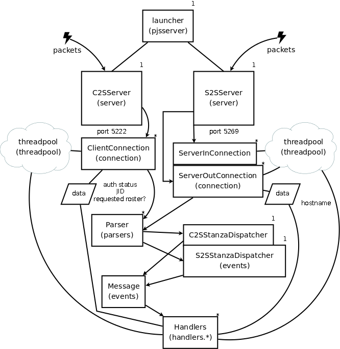
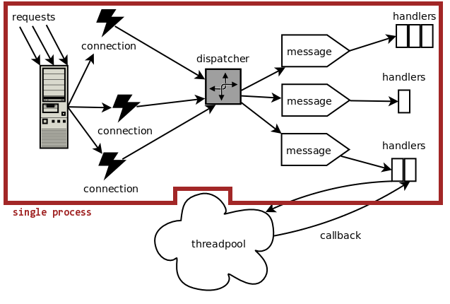
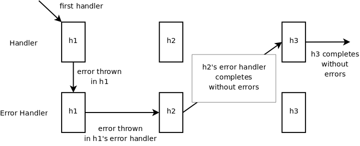

Pjabberd Design Doc
===================

Introduction
------------

[XMPP](http://www.xmpp.org/), previously known as Jabber, is an open protocol for messaging and presence. It's designed for push-style data distribution between network entities in near real-time. The core protocol is described in two RFCs, although many [extensions](http://www.xmpp.org/extensions/) are listed on the XMPP web site. [RFC 3920](http://www.xmpp.org/rfcs/rfc3920.html) and [3921][] describe concepts like streams, stanzas, authentication procedures, resource binding, the Instant Messaging (IM) aspect of XMPP, and others. XMPP is based on clients and servers—both are required. Clients connect to servers and send messages to other clients through them.

The adoption of the protocol has been steadily increasing. Many commercial entities, such as TiVo and Jive Software, use it in their products. Google's XMPP-based Talk application has thousands of users world-wide.

[Python](http://python.org/) is a dynamic object-oriented programming language with extensive support of Internet protocols. It's fairly popular, easy to learn, very appropriate for prototyping, yet lacks a usable XMPP server implementation.

Goal
----

The goal of this project is to create a framework for XMPP servers. It would provide the basic components and some helpful tools for creating concrete implementations. The goal is not to create a single monolithic server (like Openfire, for example).

Design Choices
--------------

The specific design choices are documented below.

### XML Representation ###

[ElementTree](http://effbot.org/zone/element-index.htm) is the XML library used throughout the framework. We needed XPath support, so we bundled the 1.3alpha3 version with pjabberd. Handlers are passed the parsed messages via the `tree` parameter as an instance of the `Element` class. ElementTree's parser (expat) strips the `xmlns` attributes on XML elements and changes `<elementname>` to `<{namespace}elementname>`. In order to send out uniform XML, all handlers should use `tostring()` found in `pjs.utils`, and not ElementTree's `tostring()`, since the latter produces incorrect namespaces.

### Parser ###

The standard Python's expat parser is used for parsing the incoming XML data. It is a stream parser, which means that it does not need to see the entire XML document to generate XML events. As soon as it sees an opening tag it generates an event; when it sees the closing tag it also generates an event, and so on. `pjs.parsers` defines the `IncrStreamParser`, which should be enough for most purposes. It builds an `Element` from the incoming data and passes it to a `Dispatcher`, so that it may create a `Message` object and start the processing. It catches exceptions and provides allows to recover and continue processing. This is done for some clients, like Kopete that do not start a new `<stream>` after authentication is completed (which is contrary to the spec). The parser notices a missing stream in `handle_start()` and recovers in `feed()`.

### Overview ###

The following is a high-level diagram of the server architecture.

Connections without arrows indicate usage and knowledge. Connections with arrows indicate the order during the processing of a message. The symbols `*` and `1` indicate the usual number of objects of that kind. It is not meant to imply a UML-like connection. For example, for every instance of a `Connection` there is only one `Parser`, and it is not shared between `Connection`s.

### Asynchronous Connections ###

Pjabberd uses asynchronous connections. There is only a single process that accepts and processes connections. This was done for the following reasons:

1. It has worked well for [DJabberd](http://www.danga.com/djabberd/). It's written in Perl, which is interpreted like Python and comparable in terms of performance.

2. Unlike HTTP, Jabber connections persist for a long time, so it is beneficial to have low per-connection memory overhead. The asynchronous design allows for it, because new threads aren't being spawned for every connection.

3. Python's threading performance is limited by the GIL (global interpreter lock), which allows only one thread to run inside a single interpreter at a time. Therefore, adding more threads to the server would only decrease performance due to thread-switching overhead.

4. The [Twisted](http://twistedmatrix.com/trac/) framework developers have been successful in implementing a similar concept.

This design implies that only one connection/message is being processed at a time. However, many tasks that an XMPP server must perform (such as authentication) require some form of blocking I/O, such as accessing a database. With asynchronous connections, all code running in the main thread cannot block for any reason. If it does, it will hold up the entire server. Pjabberd solves this problem by allowing individual handlers (see [chained handlers](#chained-handlers)) to run outside the main thread.

### Phases ###

Every message that comes in is assigned a "phase", a sequence of handlers. The phases are configured in `pjs.conf.phases` and `pjs.conf.handlers`. Each phase distinguishes itself from others by its XPath expression. The current version of ElementTree only support basic operations, such as matching on tag name and attributes. The phases are checked in random order, because in Python dictionaries have no order. However, if there are two or more conflicting phases, higher priorities can be assigned to create an artificial ordering. An example of this is 'c2s-presence' and 'subscription' phases for the c2s server. 'c2s-presence' matches on '{jabber:client}presence' and 'subscription' matches on '{jabber:client}presence[@type]'. If there were no priorities in phase lists, a subscription could be interpreted as a simple presence stanza.

Phases define the regular and error handlers (see below) associated with a phase. The list can be queried and modified at runtime by handlers to queue others (via `Message`'s `setNextHandler()` and `setLastHandler()`). The standard phases don't need xpath expressions defined, since the parser calls them directly. Don't change the names of these phases.

### Chained Handlers ###

When an XMPP stanza is taken off the wire, it can be handled by any class that subclasses either `Handler` or `ThreadedHandler` from `pjs.handlers.base`. If a class subclasses `Handler` then its `handle()` method is executed. If a class subclasses `ThreadedHandler` then its `handle()` method is executed, but it needs to return a tuple of `FunctionCall` objects (from `pjs.utils`) that specify how a thread should be started and how it can be checked for completion. When the thread-checking function returns `True`, the handler's `resume()` function is called, so that it may collect the result or do some cleanup. The `ThreadedHandler` classes are responsible for launching their own threads and cleaning up after themselves. The framework only knows that a `ThreadedHandler` needs to do some work that might take a while, so it lets it do whatever it needs until the checking function returns `True`. As a convenience, each server in the framework has a threadpool associated with it that handlers can drop jobs onto and retrieve results. Many classes in `pjs.handlers` use this approach. See `SASLResponseHandler` in `pjs.handlers.auth` for an example.

The handlers are chained. This means that for any type of message (as defined below) there can be a sequence of handlers that run on that message. Only one handler per message runs at a time even if the current handler is executing in another thread. The same message is passed to each handler in the chain. It can be modified by handlers, but this should probably be avoided as it will result in hard-to-debug code. If a handler needs to modify a message, it should `deepcopy()` it.

Each handler can pass the next handler in the chain some data through the `lastRetVal` parameter in `handle()` by returning a value from `handle()`. If it doesn't return anything, the `lastRetVal` is preserved and passed to the next handler. However, if a handler returns a value it will overwrite the `lastRetVal` for future handlers. Most handlers will probably want to attach a value to `lastRetVal` -- such handlers should use the `chainOutput()` function from `pjs.handlers.base`. This is how a roster push currently occurs: the handler that accepts an "iq get" message chains the roster stanza that should be sent to all of the client's connected resources. A handler can stop the chain by setting `stopChain` in the `Message` object to `True`.

The chained handlers design also allows for handling unexpected exceptions. Each handler can be paired with an "error handler" in the same phase. The error handler's `handle()` method will be executed with the exception being the last element in `lastRetVal`. If the error handler (A) throws another exception, the next handler is skipped and its error handler (B) is run. If A does not throw and exception then B's regular handler will run next.

### Threaded Handlers ###

Because we need to allow handlers to perform I/O-based operations, we need to have `ThreadedHandler`s (see above). Because the entire server is running in a single thread, and because we need to ensure that message processing is occuring in order for any client (see [RFC 3921][3921]), the `pjs.events` keeps a queue of running `Message`s per connection and skips those that are already running. When a threaded handler is done (that is, when the function is provided to the framework returns `True`) the handler's `resume()` function is called within the main thread. Basically, the execution of the handlers chain is brought back into the main process after each threaded handler's operation completes. This allows only *some* handlers in a chain to be run in a thread.

#### Implementation Note ####

Pjabberd contains a modified copy of Python's asyncore module. It adds the ability to check a function's return value on every read from a socket. This allows the `ThreadedHandler` behaviour. In addition, the modified copy contains a way to call a scheduled `Message` if it's been queued due to another `Message` already being processed for the `Connection`.

Data Persistence
----------------

The framework uses SQLite (through [pysqlite](http://oss.itsystementwicklung.de/trac/pysqlite/)) to provide persistence for data. This is not required, however. The classes that perform DB operations are independent of specific handlers. Therefore, it is possible to simply switch the handlers to ones that use a different means for storage. In the future, it will be possible to change, through a configuration file or at run time, classes like `Roster` that perform DB operations.

Internal Data
-------------

Most internals of pjabberd are stored as python dictionaries. The data stored in a `Message` object is accessible by handlers through the `msg` parameter (`msg.data`). Handlers also have access to `Connection`s and `Server`s through the `Message` object. This will change in the future, as this design is not thread-safe. Most likely, the handlers that want to access server-wide data will have to call locking/unlocking functions or use an API.

API
---

There is no API provided at the moment. Most handlers just access information through dictionaries in the `Connection`, `Server` and `Message` objects. This is simple and extensible, because new handlers can store any arbitrary data in in the dictionaries. The API was not part of a design because it was not clear what data the users of the framework would want to access and how they would like to access it. An API will probably be introduced in the next version.

There are some basic classes like `Roster` and `JID` in `roster.py` and `jid.py`, respectively.

Installation
------------

At the moment, the server does not support installation, because it is not meant to be run standalone yet. Once we have a concrete implementation in place, an installation procedure will be provided.

Running
-------

Running the existing incomplete implementation is possible as long as the `PYTHONPATH` environment variable contains the top-level jabber directory that itself contains the `pjs` directory.

	$ cd code/jabber
	$ PYTHONPATH=. python pjs/pjsserver.py

`pysqlite` is required to run the current version.

To run the tests:

	$ cd code/jabber
	$ PYTHONPATH=. python pjs/test/alltests.py

Extending
---------

To create a new handler and have it run within the current server implementation:

1. Create a new class (preferably in one of the modules in `pjs.handlers` that implements a `Handler` or a `ThreadedHandler` interface from `pjs.handlers.base`.
2. Add it to the mapping of handlers in `pjs.conf.handlers`.
3. Find an existing phase in `pjs.conf.phases` or add a new one. Attach a handler to it as done for other handlers. Make sure to add the handler to the right phase dictionary. There are core, c2s, and s2s phases available, depending on what you want to do. If you want to create an autoresponder bot, you will probably need to alter one of the c2s phases. If you want to modify the way authentication works, it's the core phases you need.

Create handlers from existing examples in modules like `pjs.handlers.iq` and `pjs.handlers.auth`. These have some boilerplate code with comments.

  [3921]: http://www.xmpp.org/rfcs/rfc3921.html

:wrap=soft:maxLineLen=100:noTabs=false:

